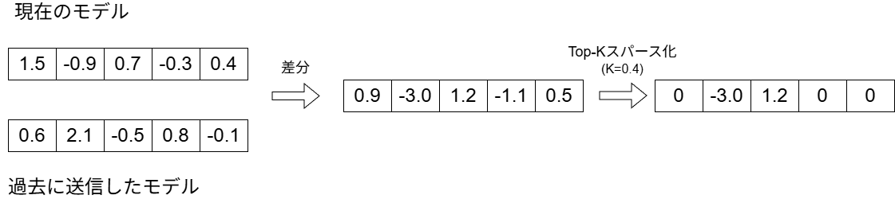
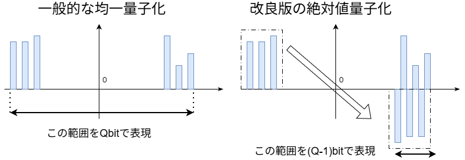
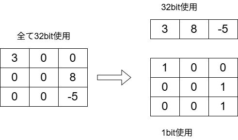
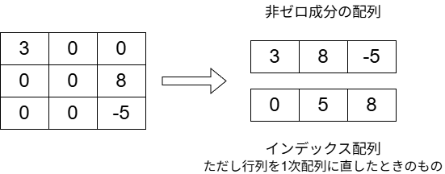
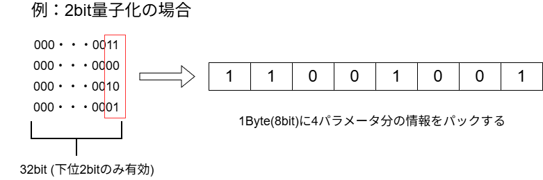
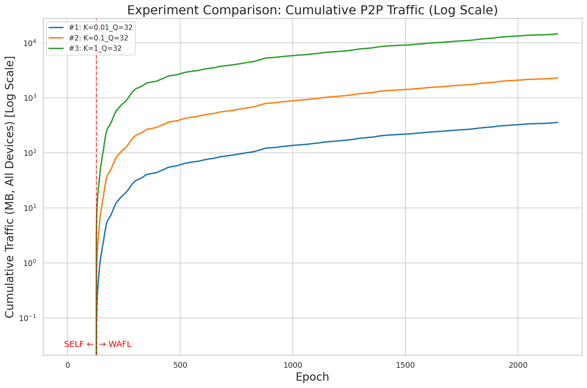
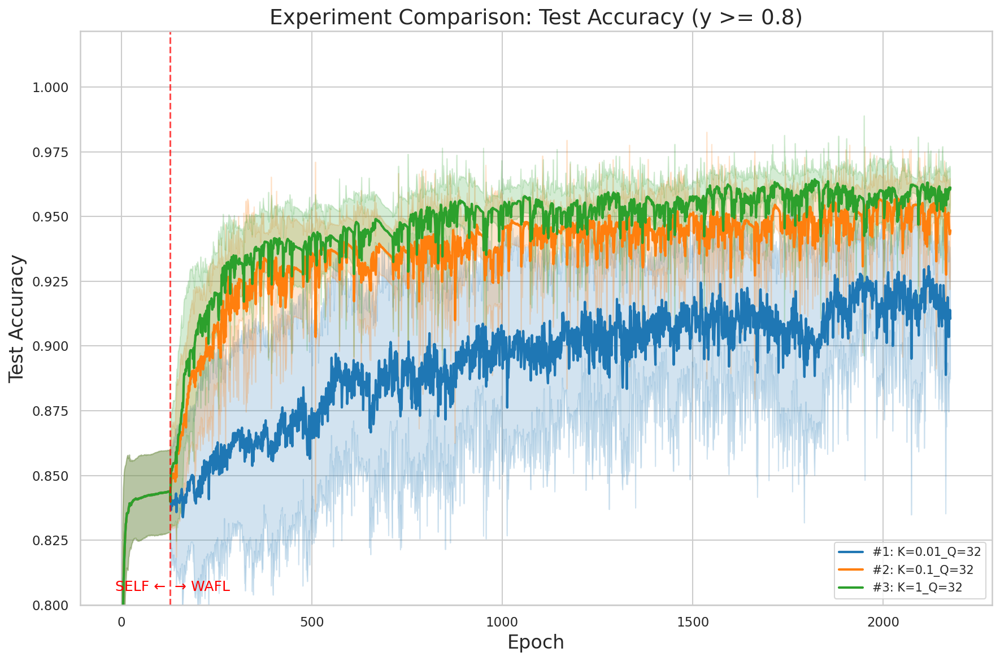

# WAFL Emulation Testbed

**Wireless Ad Hoc Federated Learning (WAFL)** — 中央サーバを介さず、デバイス同士がP2Pで直接モデルパラメータを交換する完全分散型の協調学習手法 — のための、軽量モデル交換プロトコルと、それを実機で評価するための物理テストベッドです。

> 📄 本リポジトリの研究成果である *"A Lightweight Model Parameter Exchange Protocol for Wireless Ad Hoc Federated Learning"* は **IEEE WF-IoT 2026**(World Forum on Internet of Things)に採択されました。著者: Tatsumi Yamazaki, Hiroshi Esaki, Hideya Ochiai(東京大学)。

**このリポジトリで自分が個人として設計・実装した部分:** `wafl/src/common/main4.py` と `quantize3.py` に実装された **MPE-DSQ 圧縮プロトコル** です。これは上記の採択論文および卒業研究の中心的な貢献です。物理的な10台構成のテストベッド(`ctrl/`、デプロイ・オーケストレーション層)は研究室の他メンバーとの共同開発([別論文](#この研究について))であり、自分はそのテストベッドの上にプロトコルを実装し、以下の全実験を実行しました。

## このプロジェクトの背景

WAFLはWi-FiやBluetoothなどのP2P通信を介してデバイス間で直接モデルパラメータを交換するため、中央サーバに依存する従来のFederated Learning(FL)と異なり単一障害点が存在しません。しかし、この構造には従来のFLほど深刻ではなかった問題が生じます。**すべてのデバイスペアが完全なモデルパラメータを直接交換する必要がある**にもかかわらず、NVFlareやFlowerのような中央集権型FL向けの通信効率化フレームワークに相当するものが、P2P型のWAFLには十分に整備されていません。WAFLの通信量を圧縮する先行研究(Top-Kスパース化+量子化)は単一マシン上のシミュレーションでしか評価されておらず、そこでの「通信トラフィック」はソケットやNIC、パケットロスといった実環境を一切経由せずに事後計算された数値に過ぎませんでした。本プロジェクトは、この圧縮手法を実際に実行可能な通信プロトコルとして設計し、実ネットワーク上で検証するものです。

## MPE-DSQ: 圧縮プロトコル

**M**odel **P**arameter **E**xchange with Top-K **D**ifference **S**parsification and **Q**uantization。デバイスAがデバイスBにモデルを送信する際、1バイトもソケットに送り出す前に、次の4段階の処理を行います。

### 1. 差分Top-Kスパース化

毎回のコンタクトで全パラメータを送信するのは非効率です。多くのパラメータは2回の交換の間でほとんど変化しません。各デバイスは、通信相手ごとに「その相手に最後に送信したモデル」と「その相手から最後に受信したモデル」を保持しています。送信前には、現在のモデルと最後に送信したモデルとの差分を取り、絶対値の大きい上位K%のみを残して残りを0にします。



これは *Whole Model* Top-K です(`compute_topk_threshold()` で全レイヤーのパラメータを1次元に連結した上で閾値を1回だけ計算します)。レイヤーごとに閾値を決めるLayerwise方式も検討しましたが、今回使用するMLPでは精度上のメリットが確認できなかったため、よりシンプルなWhole Model方式を採用しています。

### 2. 改良版 符号-絶対値量子化

Top-Kスパース化後も、残った値はまだfloat32のままです。`quantize3.py` はこれを最小1bitまで圧縮します。



- Qbitのうち1bitを**符号**、残りの `Q-1` bitを**絶対値**に使用し、そのレイヤーの絶対値の最小値〜最大値の範囲を線形量子化します。量子化のゼロ点を0ではなく**絶対値の最小値**に置くのがポイントです。Top-Kスパース化によって0付近の小さい値は既に切り捨てられているため、一般的な均一量子化のように0近傍の使われない範囲を量子化してしまう無駄がありません。
- **Q=1は特別扱い**: 符号bitで1bitを使い切ってしまい絶対値を表現する余地がないため、符号のみを送信し、受信側ではそのレイヤーの残存パラメータの絶対値の平均値を代表値として復元します。

### 3. 残存位置のエンコーディング(ビットマスク方式 / インデックス方式)

スパース化後の「非ゼロ値だけの配列」を復元するには、それらが元の行列のどの位置にあったかという情報も必要です。2種類のエンコード方式を実装し、Kの値によってビット数が少なくなる方を自動選択します。

<p>
  
  
</p>

- **ビットマスク方式**: 元のパラメータ1つにつき1bit → スパース度に関わらず `N` bit
- **インデックス方式**: 非ゼロ値1つにつきint32(32bit) → `N × K × 32` bit

`K > 1/32` ではビットマスク方式が、それ以下ではインデックス方式が有利になるため、`main4.py` では `BITMAP_THRESHOLD = 0.03` を境に両方式を切り替えるハイブリッド設計にしています(K=1の場合はすべての位置が残るため、どちらの位置情報も送信しません)。改良案として、インデックス配列のデルタエンコーディングも検討しましたが、非ゼロ位置が偏って分布している場合にしか効果がなく、均等に分布する最悪ケースでは通常のint32インデックスと同じビット数になってしまうため、実装の複雑さに見合わないと判断し採用しませんでした。

### 4. ビットパッキング

1/2/4bitに量子化した値は、そのままではバイト境界に揃いません。TCP通信はビット単位ではなくバイト単位でデータを扱うため、1バイトに複数の値を詰め込みます(Q=1では1バイトに8個、Q=8以上では1バイトに1個)。値の個数がバイト境界にきっちり収まらない場合は、末尾を0でパディングします。



### 全体の流れ

```
   送信側 (Sender)                                        受信側 (Receiver)
   ──────────────                                         ──────────────
   current_model
        │
        ▼
   diff = current − prev_model_sent[peer]
        │
        ▼
   Top-Kスパース化 (絶対値上位K%のみ保持)
        │
        ▼
   符号-絶対値量子化 (Qbit) + ビットパッキング
        │
        ▼
   pickle + zlib圧縮  ── TCP送信 ──▶  zlib解凍 + pickle復元
                                                     │
                                                     ▼
                                              逆量子化
                                                     │
                                                     ▼
                                  reconstructed = prev_model_received[peer] + diff
```

実際にレイヤーごとに送信されるデータ構造(`wafl/src/common/main4.py` の `_create_sparse_diff`):

```python
sparse_data = {
    "fc1.weight": {
        "is_empty": False,
        "shape": [128, 784],
        "numel": 100352,
        "quantized_data": b"...",   # ビットパッキングされた符号+絶対値
        "scale": 0.0234,             # 量子化ステップ幅 (Q=1の場合は絶対値の平均)
        "zero_point": 0.0012,        # 絶対値の最小値
        "q_numel": 80,                # 残存(非ゼロ)パラメータ数
        "bits": 4,
        "all_zero": False,
        "use_bitmap": False,          # -> "indices": b"..." (int32の位置情報)
        # または "use_bitmap": True  # -> "bitmap": b"..."   (パックされた1bitマスク)
        # または "no_sparsity": True # (K=1: 全パラメータが残存し位置情報が不要)
    },
    "fc1.bias": {"is_empty": True, "shape": [128]},  # このレイヤーはTop-Kで全て0になった
    # ...
}
```

実装で実際に苦労した点として、量子化後に送信側は**自分が送ったばかりのdiffを自分でも逆量子化**し、その(量子化誤差を含む)結果を `prev_model_sent[peer]` としてキャッシュする必要があります。量子化前の正確なモデルをキャッシュしてしまうと、送信側と受信側で「相手と最後に交換したモデル」の認識が徐々にズレてしまい、以降のdiff計算がすべて誤ったベースラインに対して行われることになります。

### 実験結果 (MNIST, MLP, 10デバイス, 自己学習128epoch + WAFL学習2048epoch)

| 設定 | K (Top-K残存率) | Q (量子化bit数) | 非圧縮時との通信量比 | 精度低下 |
|---|---|---|---|---|
| 非圧縮ベースライン | 1.0 | 32 | 100% (計14.7GB) | — |
| 中程度の圧縮 | 0.1 | 4 | **4.27%** | **1.20%** |
| 積極的な圧縮 | 0.01 | 1 | **1.14%** | 4.55% |

<p>
  
  
</p>

K∈{1, 0.1, 0.01} × Q∈{32, 8, 4, 2, 1} の全15条件の詳細な結果と評価手法は、卒業論文および採択論文(本リポジトリには含まれていません。[こちら](#この研究について)を参照)に記載しています。

## テストベッド(チームでの共同開発部分)

上記のプロトコルを実際に動かす実行環境が、本リポジトリの残りの部分です。研究室の他メンバーとの共同プロジェクトとして構築した、実行サーバ10台+管理サーバ1台からなる物理テストベッドで、実際のLAN上でTCPソケットを使い、`tcpdump`で通信量を実測しながらWAFL実験を実行します。つまり上記の通信量の数値は、シミュレータが事後計算した数字ではなく、実際にケーブルを流れたトラフィックです。

## アーキテクチャ

```
                         ┌────────────────────┐
   自分のPC ── SSH ─────▶│    管理サーバ        │
                         │  (ctrl/, 本リポジトリ) │
                         └──────────┬──────────┘
                                    │ LAN (コード/データのデプロイ、
                                    │      epochの開始・終了の同期、結果収集)
              ┌─────────────────────┼─────────────────────┐
              ▼                     ▼                     ▼
     ┌─────────────────┐   ┌─────────────────┐   ┌─────────────────┐
     │  実行サーバ0        │   │  実行サーバ1        │  …  │  実行サーバN        │
     │  (wafl/, device 0) │  │  (wafl/, device 1) │     │  (wafl/, device N) │
     └─────────┬─────────┘   └─────────┬─────────┘     └─────────┬─────────┘
               └───────────────  P2Pモデル交換  ─────────────┘
                       (実行サーバ間で直接TCP通信)
```

- **実行サーバ**は各自のローカルデータで1epoch分学習を行い、他の実行サーバと直接モデルパラメータを交換します(P2P — 管理サーバはこの通信経路には一切関与しません)。
- **管理サーバ**は各実行サーバへコード・設定・データセットをSSH経由でデプロイし、TCPの制御チャネルで各epochの開始・終了を同期し、実験後に結果を収集します。管理サーバ自身は学習計算を一切行いません。

## リポジトリ構成

```
WAFL-Testbed/
├── ctrl/                      # 管理サーバ側: オーケストレーション・結果収集・分析
│   ├── main.py                 # 実験オーケストレータ (設定デプロイ、epoch進行、終了処理)
│   ├── deploy.sh                # コード/データを管理サーバにrsync/scpし、各実行サーバへ展開
│   ├── run_batch.sh              # 複数の実験を無人で連続実行する
│   ├── collect.py                # 各実行サーバから結果を回収する
│   ├── analyze.py                # 1つの実験の学習曲線を集計・プロットする
│   ├── compare.py                # 複数の実験を並べて比較・プロットする
│   └── parameters.json            # 実験パラメータのデフォルト値 (epochs, K, Q, contact pattern...)
├── wafl/                       # 実行サーバにデプロイされる (common/ + デバイス別の上書き)
│   ├── src/common/
│   │   ├── main.py               # 非圧縮ベースラインエージェント (通常のWAFL、MPE-DSQなし)
│   │   ├── main4.py               # MPE-DSQエージェント: 差分Top-Kスパース化+量子化
│   │   ├── quantize3.py            # main4.pyが使用する量子化器
│   │   └── net.py                  # MLPモデル定義
│   ├── config/                  # デバイス別のランタイム設定 (デプロイ時に生成)
│   └── dataset/                  # デバイス別のデータセット分割 (utils/で生成、gitignore対象)
├── utils/                      # 実験前に一度だけ実行するオフラインのデータ準備スクリプト
│   ├── generate_contact_pattern.py  # ランダムウェイポイントモビリティシミュレーション → コンタクトパターンJSON
│   ├── generate_nonIID_filters.py    # 非IIDなラベル分布フィルタの生成
│   └── generate_datasets.py           # MNISTをデバイス別のtrain/test/validateに分割
├── assets/                      # 本READMEで使用する図・結果画像
├── results/                     # 実験結果の出力先 (gitignore対象、実行時に生成)
├── .env.sample                  # デプロイ先設定のテンプレート
├── mise.toml                    # タスクランナー (setup/lint/deploy/start/analyze)
└── pyproject.toml               # Pythonプロジェクト設定 + ruff設定
```

`wafl/` 配下は、まず `common/` の内容が全実行サーバに共通でデプロイされ、その後 `0/`, `1/`, ... のようなデバイス番号のディレクトリに置かれたファイルがあれば、それが上書きされます(例: `wafl/config/0/`)。

`main.py` と `main4.py` は意図的に両方残しています。`main.py` は比較用の非圧縮ベースライン、`main4.py` がMPE-DSQの実装です(開発中には `main2.py`/`main3.py` という中間バージョンも存在しましたが、`main4.py` に完全に置き換えられたため本リポジトリからは削除しています)。

## セットアップ

### 前提条件

- Python 3.11.4 (miseで自動インストール)
- **まずハードウェア、その次にソフトウェア**: 本プロジェクトは、**管理サーバ1台と実行サーバ1台以上が既にセットアップされ、ネットワークで到達可能な状態にあること**を前提としています。以下の手順はそのハードウェアの上にソフトウェアをデプロイするものであり、ハードウェア自体を用意するものではありません。
  - 全マシンが同一LAN上(あるいは相互に到達可能なネットワーク上)にあり、それぞれ個別のIPアドレスを持っていること。
  - 管理サーバから各実行サーバへSSH接続でき、パスワードなしの公開鍵認証(`~/.ssh/id_ed25519` など、SSHエージェントに鍵をロードしておく)が設定されていること。`deploy.sh`/`ctrl/main.py` が無人で実行できるようにするためです。
  - 各実行サーバは個別のIPアドレスが必要です。制御用TCPポートとP2Pポート(`WAFL_DEVICE_CTRL_PORT`/`WAFL_DEVICE_P2P_PORT`)は全デバイスで**共通**の値を使うため、コードを変更しない限り1台のホスト(1つのIP)に複数の実行サーバを立てることはできません。
  - 論文の実験では実行サーバ10台+管理サーバ1台の構成を用いましたが、コード上台数に上限はありません。`ctrl/execution_config` の `WAFL_DEVICE_NAMES`/`WAFL_DEVICE_IPS` の要素数を揃えるだけで台数を変更できます。

### 1. miseのインストール

[mise](https://mise.jdx.dev/) がPythonランタイムのバージョンと各タスクを管理します。

```bash
curl https://mise.run | sh
echo 'eval "$(~/.local/bin/mise activate bash)"' >> ~/.bashrc   # bashの場合。zshなら ~/.zshrc に
source ~/.bashrc
mise --version
```

### 2. 環境変数の設定

マシン名・IPアドレス・デプロイ先パスなどはすべてコードやgitの外に置きます。以下の2つのgitignore対象ファイルに、自分の環境に合わせた値を設定してください。

```bash
cp .env.sample .env
```

`.env` を編集(管理サーバへの接続に `mise` タスクが使用):

```bash
DEPLOY_CTRL_SERVER_USER=your_username
DEPLOY_CTRL_SERVER_HOST=your_ctrl_server_hostname
DEPLOY_CTRL_SERVER_DIST=/path/to/deployment/directory
```

```bash
cd ctrl
cp execution_config_sample execution_config
```

`ctrl/execution_config` を編集(管理サーバから各実行サーバへの接続に使用):

```bash
export CTRL_SERVER_IP='192.168.11.10'
export WAFL_DEVICE_NAMES='100,101,102,103,104,105,106,107,108,109'
export WAFL_DEVICE_IPS='192.168.11.100,192.168.11.101,...'
export WAFL_DEVICE_CTRL_PORT=10001
export WAFL_DEVICE_P2P_PORT=10002
export USER='your_username'
export DEPLOYMENT_LOCATION='/path/to/workspace'
export EXPERIMENT_NAME='your_experiment_name'
```

`WAFL_DEVICE_NAMES` と `WAFL_DEVICE_IPS` は要素数を一致させてください。`.env` と `execution_config` はどちらもgitには含まれず、`.sample` の付いたテンプレートのみがコミットされます。

### 3. 依存パッケージのインストール

```bash
mise setup
```

Python、[uv](https://docs.astral.sh/uv/) のインストール、`.venv` の作成、依存パッケージのインストール、pre-commitフックの設定までを行います。

### 4. VS Code (任意)

推奨拡張機能: [Ruff](https://marketplace.visualstudio.com/items?itemName=charliermarsh.ruff), [Python](https://marketplace.visualstudio.com/items?itemName=ms-python.python)。インタプリタは `.venv/bin/python` を選択してください。

## 使い方

### データセットとコンタクトパターンの生成

```bash
source .venv/bin/activate
python utils/generate_nonIID_filters.py
python utils/generate_datasets.py
python utils/generate_contact_pattern.py   # 論文で使用したデフォルトのランダムウェイポイントパターンを再現
```

これらのスクリプトが生成するファイルはすべて `data/` と `wafl/dataset/` に配置され、gitignore対象です。cloneした環境ではgit経由ではなく、これらのスクリプトを実行してローカルで再生成します。

### 実験の設定と実行

`ctrl/parameters.json` を編集:

```json
{
  "epochs": { "self": 128, "wafl": 2048 },
  "contact_pattern": "rwp_n10_a0500_r100_p10_s01.json",
  "wafl_phase": {
    "aggregation_strategy": "FedAvg",
    "batch_size": 32,
    "learning_rate": 0.001,
    "coefficiency": 1.0,
    "sparsification_K": 0.1,
    "quantization_Q": 4
  }
}
```

```bash
mise start
```

`mise start` は管理サーバと各実行サーバへプロジェクトをデプロイした後、`ctrl/main.py` を起動します。`ctrl/main.py` はSELF(ローカル学習のみ)フェーズに続いてWAFL(P2P交換)フェーズをepochごとに進行させ、各デバイスの制御用TCPポートをポーリングして進捗を確認します。`K`/`Q`/epoch数/実験名は、ファイルを編集せずコマンドライン引数で上書きすることもできます。

```bash
python ctrl/main.py --experiment_name my_run --K 0.1 --Q 4 --wafl_script src/main4.py
```

非圧縮ベースラインを実行する場合は `--wafl_script src/main.py` を指定します。複数の実験を無人で連続実行したい場合は `ctrl/run_batch.sh` に実験の一覧を記述して実行してください。

実行中の実験を監視する:

```bash
ssh ${DEPLOY_CTRL_SERVER_USER}@${DEPLOY_CTRL_SERVER_HOST}
screen -r wafl
```

### 結果の収集と分析

```bash
mise analyze   # 管理サーバ上でcollect.py → analyze.pyを実行し、results/をローカルにrsync
```

または、結果がローカルにある状態で個別に実行:

```bash
python ctrl/collect.py [experiment_id]           # 省略時は最新の実験を対象にする
python ctrl/analyze.py [experiment_id]           # 1実験分の精度・損失曲線を出力
python ctrl/compare.py exp_a exp_b exp_c          # 複数実験を並べて比較
```

結果は `results/<experiment_id>/` に保存されます。

## 開発

利用可能な `mise` タスク:

- `mise setup` — Python、uv、依存パッケージ、pre-commitフックのインストール
- `mise lint` — ruffによるチェック(自動修正あり)
- `mise deploy` — 管理サーバと各実行サーバへのデプロイ
- `mise start` — デプロイ後に実験を開始
- `mise analyze` — 最新の実験結果を収集・分析

```bash
source .venv/bin/activate
uv add <package-name>
```

## この研究について

本リポジトリに含まれるのは実行可能なフレームワーク(コード)のみで、データや認証情報は含みません。このコードの土台となった卒業論文本体、およびIEEE WF-IoT 2026採択論文のカメラレディ版は、非公開のディレクトリ(論文PDF/ソース + IEEEカンファレンステンプレート)で管理しており、本リポジトリには含めていません。

本研究からは2本の論文が生まれています。

1. *"A Lightweight Model Parameter Exchange Protocol for Wireless Ad Hoc Federated Learning"* — Tatsumi Yamazaki, Hiroshi Esaki, Hideya Ochiai. **IEEE WF-IoT 2026 採択。** 上記で説明したMPE-DSQプロトコルの設計・実装・評価を行った、個人の卒業研究です。
2. *"An Emulation Platform for Wireless Ad Hoc Federated Learning: Design, Implementation, and Case Study"* — Namit Vishal Shah, Kosei Takahashi, Tatsumi Yamazaki, Natsuki Zenko, Hiroshi Esaki, Hideya Ochiai. IEEE International Conference on Knowledge and Smart Technology, 2026. 本リポジトリの土台となっているテストベッド(`ctrl/`)について、共著者らと共同で執筆したものです。
